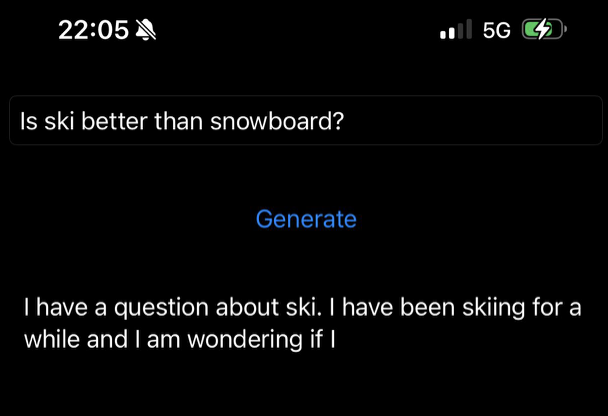

# local-chat
IOS app which runs LLM inference locally, i.e. on device.

Tested with:
* [facebook/opt-125m](https://huggingface.co/facebook/opt-125m)
* [google-bert/bert-base-uncased](https://huggingface.co/google-bert/bert-base-uncased)

The models must be converted to a format compatible with Core ML, see [llm-to-coreml](https://github.com/alexkachurka/llm-to-coreml).

